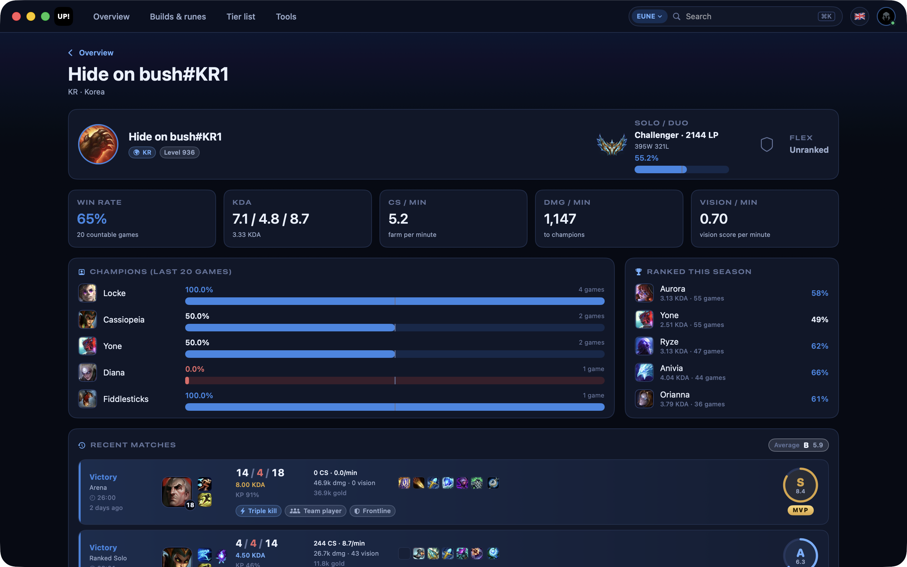
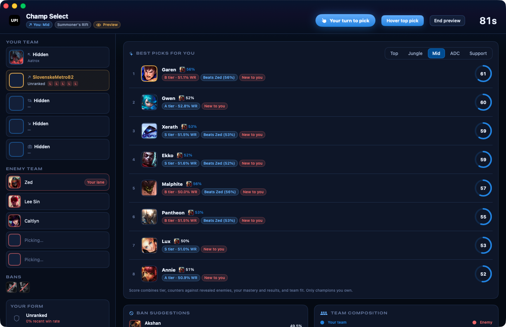
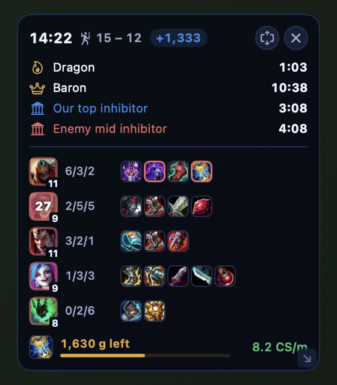
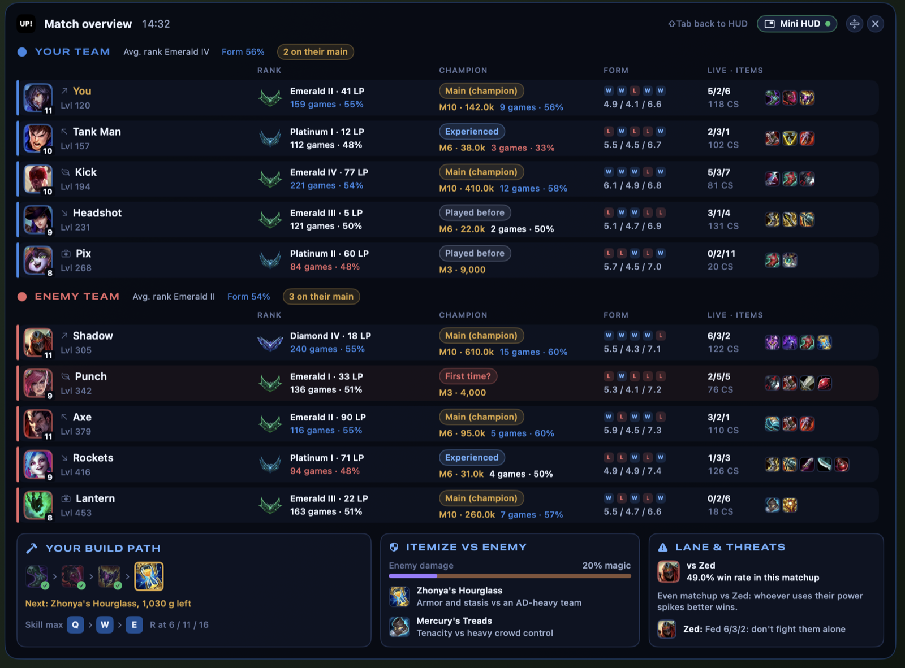
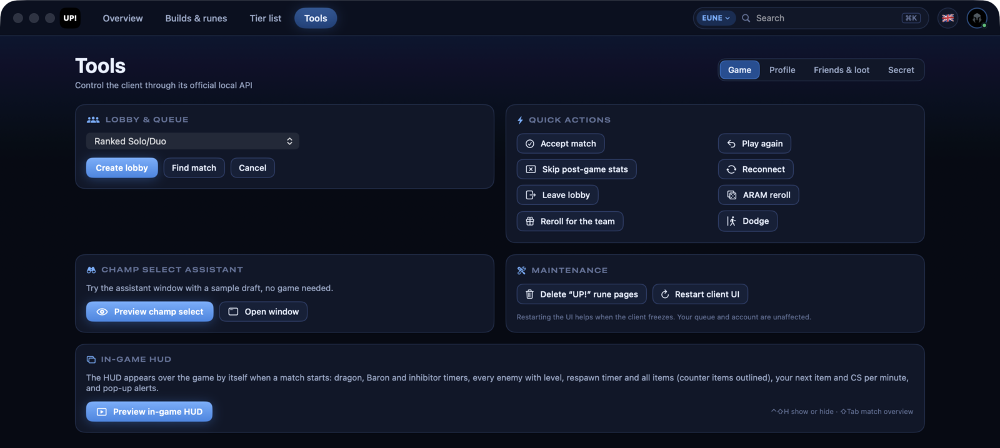
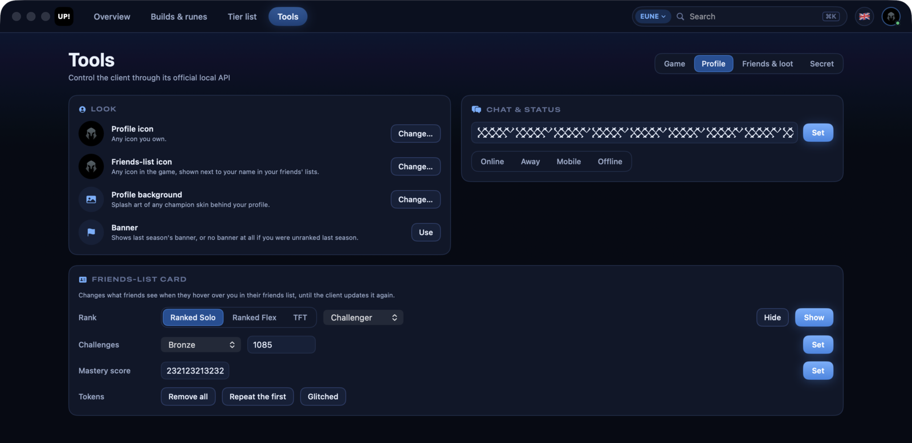

<p align="center">
  
</p>

<h1 align="center">UP!</h1>

<p align="center">
  <b>A native macOS companion for League of Legends.</b><br>
  It tells you what to pick and why, imports the runes and the build, scouts the lobby and keeps the timers while you play.
</p>

<p align="center">
  
  
  
  
</p>

<p align="center">
  <a href="https://github.com/sajmonekk191/UP/releases/latest"><b>⬇ Download the latest release</b></a>
</p>



---

## Champ select, with reasons



The assistant opens by itself when champ select starts. Every champion you own gets a score out of 99 for your role, and the reasons behind it: how it does against the enemies revealed so far, your mastery and recent results, and the damage type your team is missing. Ban suggestions and a composition read come with it.

Hover a champion and its best rune pages, summoner spells and item set are one click away — or let UP! import them the moment you lock in.

## The HUD while you play

<p align="center">
  
</p>

Dragon, Baron and inhibitor timers, every enemy with level, KDA and full items (counter items outlined), the gold left to your next item and your CS per minute. <kbd>⌃</kbd><kbd>⇧</kbd><kbd>H</kbd> hides it. It draws over the game in windowed or borderless mode.

<kbd>⇧</kbd><kbd>Tab</kbd> opens the full match overview: everyone's rank and how they are doing this season, how much they play the champion they picked, their last five games, and their live KDA, CS and items. Under it, your build path, what to buy against this enemy team and how your lane matchup is going.



## Tools for the client



Open a lobby for any queue the client offers, custom games with bots included. Accept a match, leave a lobby, reroll in ARAM — or reroll and take your champion back from the bench, so the new one is left to your team. Restart the client UI when it freezes, and try the champ select window and the HUD without a game.

### Make the client yours



Wear any icon in the game next to your name in your friends' lists, put the splash art of any champion skin behind your profile, and choose what friends see when they hover you: rank, challenge crystal and points, mastery score, or no tokens at all.

Two more tabs answer friend requests in bulk and turn loot into essence and keys, and the last one keeps the extras: your collection with the day you bought every champion, a notification in the client, closing the client window during a game to free memory, and a backup of your in-game settings and hotkeys.

## The rest

- **Builds and runes** for Summoner's Rift, ARAM and **Arena** — augments by rarity, prismatic items and the best duo partners. Hover any item or rune for its description.
- **Tier list** of the current patch, click any champion to open its build.
- **Match history** graded from S+ to D, with damage and gold charts, and every player one click from their profile.
- **Player scouting** on any server: rank, form, main champions and their last games.
- **10 languages**, switched in Settings without a restart.

## Install

1. Download the `.dmg` from [Releases](https://github.com/sajmonekk191/UP/releases/latest).
2. Drag **UP!** to Applications.
3. First launch: right-click the app and choose **Open**. The build is ad-hoc signed, not notarized, so macOS asks once.

Needs macOS 14 Sonoma or later and the League client installed. One build runs on both Apple Silicon and Intel Macs.

<details>
<summary>Build it yourself</summary>

```bash
git clone https://github.com/sajmonekk191/UP.git
cd UP
./scripts/build-app.sh        # dist/UP!.app
./scripts/make-release.sh     # universal build, DMG and ZIP in dist/
```

Needs a Swift 6 toolchain (Xcode 16 or later). `swift build && .build/debug/UP` runs it straight from source.
</details>

<details>
<summary>Keyboard shortcuts</summary>

| Shortcut | Action |
|---|---|
| <kbd>⌘</kbd><kbd>1</kbd> – <kbd>⌘</kbd><kbd>4</kbd> | Overview, Builds & runes, Tier list, Tools |
| <kbd>⌘</kbd><kbd>K</kbd> | Search champions, players and #tags |
| <kbd>⌘</kbd><kbd>[</kbd> | Back from match history or a player profile |
| <kbd>⌘</kbd><kbd>⇧</kbd><kbd>D</kbd> | Open the champ select window |
| <kbd>⌘</kbd><kbd>⇧</kbd><kbd>A</kbd> | Accept the match |
| <kbd>⌃</kbd><kbd>⇧</kbd><kbd>H</kbd> | Show or hide the HUD (works in game) |
| <kbd>⇧</kbd><kbd>Tab</kbd> | HUD or match overview, while the game is in front |
| <kbd>⌘</kbd><kbd>,</kbd> | Settings |
</details>

## Fair play

UP! only talks to interfaces Riot's own software exposes: the client's local API (LCU), the Live Client Data API during a game, and public statistics from op.gg. It **never reads or writes game memory**, never injects into the game and never touches Vanguard. No Riot API key, everything runs on your machine.

Everything it does is something you could do by hand in the client. It does not pick or ban for you, does not reveal names the client hides in ranked champ select, and never shows information the game hides from you.

> The LCU is not officially supported, so endpoints can change with a client patch.

## Legal

UP! isn't endorsed by Riot Games and doesn't reflect the views of Riot Games or anyone officially involved in producing or managing Riot Games properties. Riot Games, League of Legends and all associated properties are trademarks or registered trademarks of Riot Games, Inc.

Build statistics, account search and profiles on other servers come from op.gg. UP! isn't affiliated with op.gg.

**License:** not chosen yet. Until a `LICENSE` file is added, all rights are reserved.
